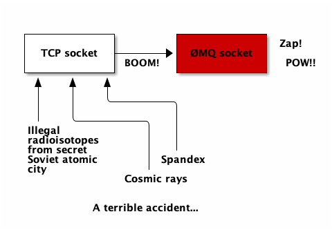
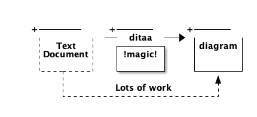
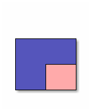

GIT DOWN TESTING
===============

A ØMQ socket is what you get when you take a normal TCP socket, inject it with a mix of radioactive isotopes stolen from a secret Soviet atomic research project, bombard it with 1950-era cosmic rays, and put it into the hands of a drug-addled comic book author with a badly-disguised fetish for bulging muscles clad in spandex.  Yes, ØMQ sockets are the world-saving superheros of the networking world.

_This documentation was generated from gitdown_test/README.txt using [Gitdown](https://github.com/zeromq/gitdown)_
